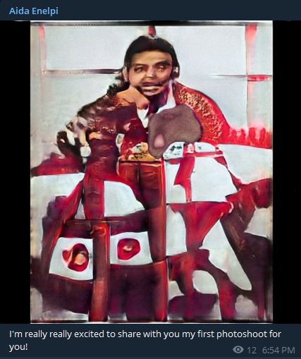
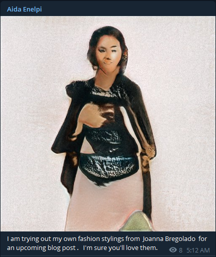

# Neural network Telegram bot with StyleGAN and GPT-2

## The Beginning
So we have already played with different neural networks. Cursed image generation using GANs, deep texts from GPT-2 — we have seen it all. \
\
This time I wanted to create a neural entity that would act like a beauty blogger. This meant it would have to post pictures like Instagram influencers do and generate the same kind of narcissistic texts. \
\
Initially I planned to post the neural content on Instagram but using the Facebook Graph API which is needed to go beyond read-only was too painful for me. So I reverted to Telegram which is one of my favorite social products overall. \
\
The name of the entity/channel (Aida Enelpi) is a bad neural-oriented pun mostly generated by the bot itself.

  

## StyleGAN
I really liked the  at generating images but I understood it would take too much compute power to transfer learn such a model on either my PC or Colab/Kaggle. \
\
So I took the beautiful <a href="{{ 'https://github.com/ak9250/stylegan-art' | url }}">Stylegan-art repository</a> as the basis for my training. My <a href="{{ 'https://www.kaggle.com/guitargz/stylegan-social/edit/run/58632173' | url }}">Kaggle </a> also used the model trained by StyleGAN-art as the initial point for transfer learning. I chose Kaggle over Colab because normally you get better GPUs in the free version. \
\
I took the available <a href="{{ 'https://www.kaggle.com/prithvijaunjale/instagram-images-with-captions' | url }}">Instagram dataset</a> and reduced it to 7000 512x512 images not to go out of memory during the training. 
   

 
I think the quality of training has suffered due to a lot of different image types (selfies, full persons, cats, food, etc.) in the dataset. I plan to create more specific datasets (for example, only selfies) and transfer learn based on them.
  
The standard <a href="{{ 'https://github.com/NVlabs/stylegan' | url }}">StyleGAN</a>  would not support running on CPU even in the generator mode where it does not need too much PC beef. So I found this little <a href="{{ 'https://github.com/huaji0353/styleGAN_CPU' | url }}">patch</a> which allowed running the generator on a small machine without a GPU. 
   

# GPT-2
I was going to use the biggest available GPT-2 XL (with 1.5 billion parameters) from <a href="{{ 'https://huggingface.co/transformers/' | url }}">Huggingface</a>. However, when I made my first tests on the smallest GPT-2 with 134 million parameters I immediately liked the quality of the generated texts. I even ended up not finetuning the pretrained model further (however, I might explore this way in the future).\
\
After all, I wanted to match the average beauty blogger's post intelligence level, so no overkill was needed here. Slightly chaotic babble of the smallest GPT-2 suited the goal just fine.\
\
Anyway, the following models are available in the Transformers library (along with many other non-GPT ones):

| Model |	Parameters |Size |
--------|------------|------
gpt2 | 134 M | 548 MB
gpt2-medium |335 M | 1.52 GB
gpt2-large | 774 M | 3.25 GB
gpt2-xl |	1.5 B | 6.43 GB 

 

# Under the hood
The bot is written in Python using the amazing <a href="{{ 'https://github.com/aiogram/aiogram' | url }}">aiogram</a> framework. It provides asychronous processing and is very fast. The bot (narcissistically enough) does not currently listen to the user input and only posts the neural content to its Telegram channel. \
\
The main bot application has been containerized with <a href="{{ 'https://www.docker.com/' | url }}">Docker</a>. The StyleGAN and GPT-2 run in their respective Docker containers. First, I used the standard Tensorflow and Transformers images on Docker Hub, but ended up multistage building my own images because of the smaller resulting image size.\
\
At first, all the containers used the same binded local volume. Then the neural generated content would be saved in the shared folder and picked up by the main app. It worked well, but smelled too much like the 1990-s. So now the Docker containers communicate using the <a href="{{ 'https://redislabs.com/redis-best-practices/communication-patterns/pub-sub/' | url }}">Redis Pub/Sub</a> (Publisher/Subsriber paradigm). It is not only modern, fast and pretty but also flexible so the app can be easily extended with more profound communication logic between the bot and neural networks. The Redis server also runs in its own Docker image.\
\
The repo for the whole stuff is available <a href="{{ 'https://github.com/guitargz/aidabot' | url }}">here</a> so feel free to have fun with it!

